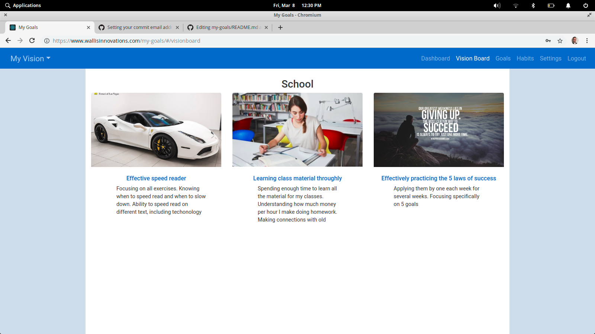
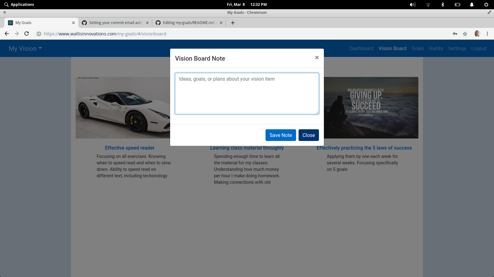
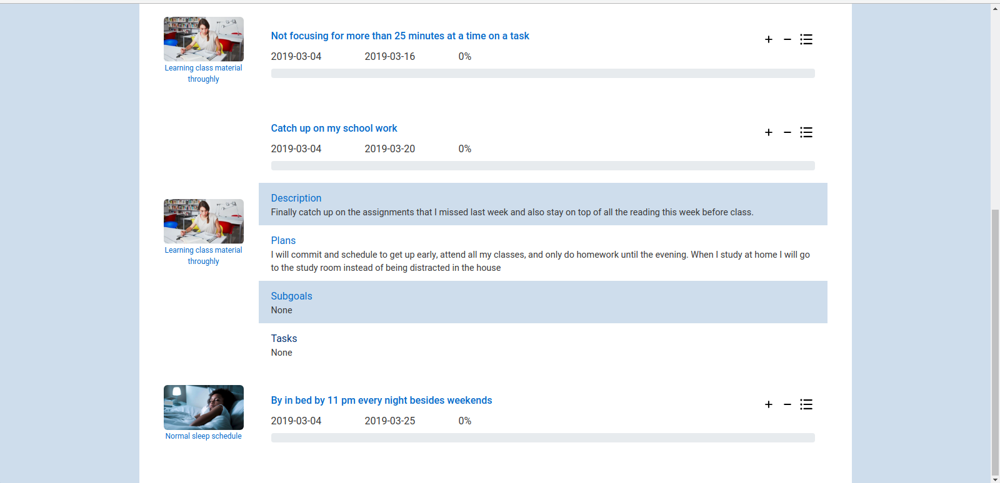
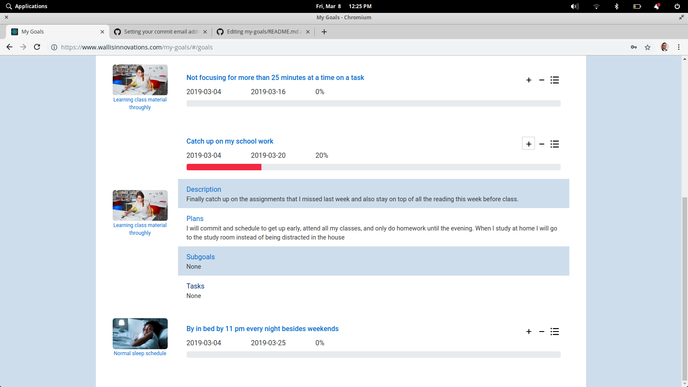

## Overview ##
  Serving a mission for the Church of Jesus Christ of Latter-day Saints, I became fascinated with the idea of creating and growing a vision. Our vision is really what we envision ourselves doing and becoming in the future. Essential to that creation is drafting and managing a vision board. In progressing towards accomplishing vision items, goals should be set that help one to make progress along the way. My Goals was made in an effort to reduce the headache in making a paper vision board out of images or magazine cut outs.

This project was bootstrapped with [Create React App](https://github.com/facebook/create-react-app).

This project includes a client (this project) and an API backend found <a href="https://github.com/trey-wallis/my-goals-api">here</a>

### Vision Board ###

  

## Add notes on your vision items ##

  

## Track SMART goals ##

  

## View progress ##

  

#### Copyright ####
Anyone may use and distribute this code freely. This project will be used mainly as a resume piece of mine, but it has also given me needed experience using React.js and Postgresql database management
